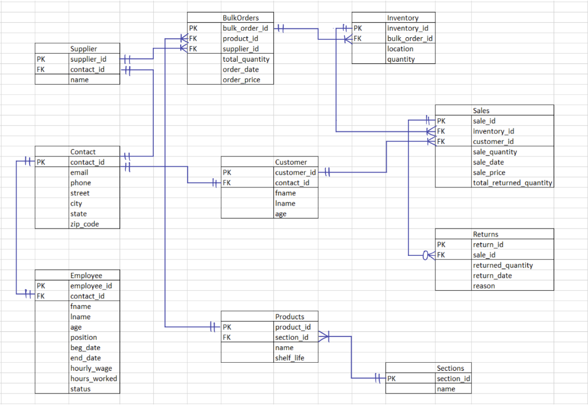

## Requirements
- Microsoft SQL Server 2019 or later
- JDK 11 or later
- Windows 10/11 (Virtual Machine supported)
- Dependencies: JDBC Driver for SQL Server, SQL Management Studio

## Set up:
1. Replace sa password
3. In Microsoft SQL Server Management Studio:
	- complete_database.sql
    - example_data.sql
4. Run App.java

## ER Diagram:

